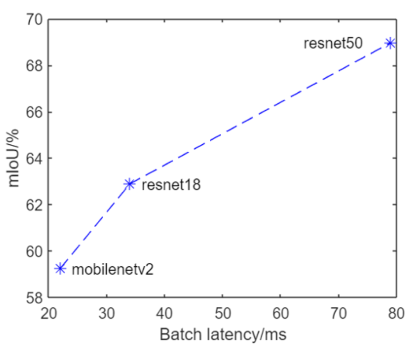
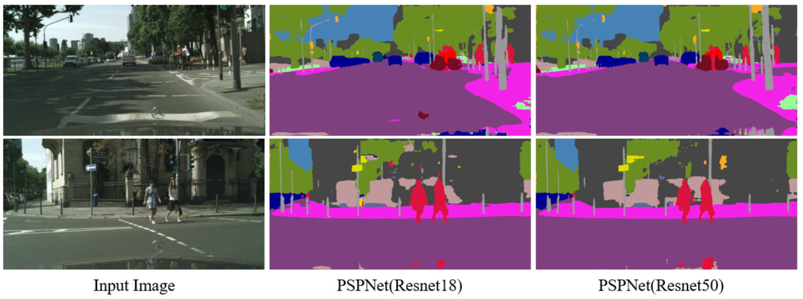
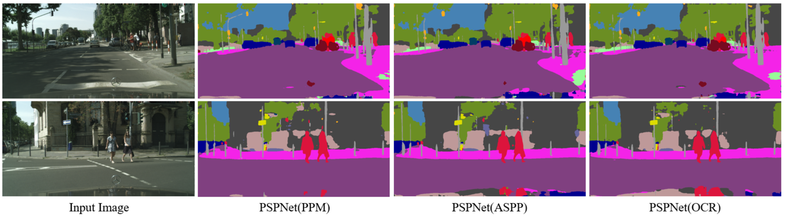
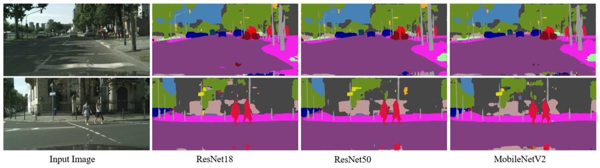

# Semantic Segmentation on Cityscapes

State-of-the-art semantic segmentation with multiple architectures and efficiency optimization.

## 📊 Overview

Implementation of semantic segmentation networks with focus on **accuracy-efficiency trade-offs**:

- **PSPNet** - Pyramid pooling for multi-scale context aggregation
- **ASPP** - Atrous Spatial Pyramid Pooling with dilated convolutions
- **OCR** - Object-Contextual Representations with attention mechanism
- **MobileNetV2** - Efficient backbone for mobile deployment
- **ResNet101** - Deep backbone for maximum accuracy

## 🎯 Key Results

### Performance Summary

| Backbone | Module | mIoU | mAcc | allAcc | Latency (ms) | mIoU/Speed |
|----------|--------|------|------|--------|--------------|------------|
| ResNet18 | PSPNet | 62.89% | 71.05% | 93.36% | 34 | 18.5 |
| ResNet50 | PSPNet | **68.97%** | 76.67% | 94.52% | 79 | 8.7 |
| MobileNetV2 | PSPNet | 59.25% | - | - | **22** | **25.17** |
| ResNet101 | PSPNet | **71.07%** | - | - | 183 | 5.45 |

**Device:** NVIDIA 2080Ti

### Context Aggregation Modules (ResNet18 Backbone)

| Module | mIoU | mAcc | allAcc | Notes |
|--------|------|------|--------|-------|
| **PPM** | **62.89%** | 71.05% | 93.36% | Pyramid pooling (baseline) |
| ASPP | 62.09% | 71.08% | 93.34% | Atrous convolutions |
| OCR | 61.86% | 70.87% | 93.31% | Most consistent segmentation |

### Efficiency Analysis

**MobileNetV2 Advantages:**
- 🚀 **3.0x faster** than ResNet50 (22ms vs 79ms)
- 📉 Only **9.7% mIoU drop** (59.25% vs 68.97%)
- ✅ **Mobile-ready** for embedded deployment

**mIoU-Speed Trade-off:**



---

## 🏗️ Architecture Details

### Task 1: PSPNet Implementation

**Pyramid Scene Parsing Network** aggregates context from different image regions.

#### ResNet18 Backbone Configuration:
- **Feature dimension:** 512
- **Layer 3 conv1:** dilation=(2,2), padding=(2,2), stride=(1,1)
- **Layer 4 conv1:** dilation=(4,4), padding=(4,4), stride=(1,1)
- **Downsampling:** Modified stride=(1,1)

#### ResNet50 Backbone Configuration:
- **Feature dimension:** 2048
- **Layer 3 conv2:** dilation=(2,2), padding=(2,2), stride=(1,1)
- **Layer 4 conv2:** dilation=(4,4), padding=(4,4), stride=(1,1)
- **Downsampling:** Modified stride=(1,1)

#### Pyramid Pooling Module (PPM):
- **Bins:** [1, 2, 3, 6]
- **Sequence:** AdaptiveAvgPool2d → Conv2D → BatchNorm2d → ReLU
- **Concatenation:** All pyramid levels concatenated
- **Upsampling:** F.interpolate to match input size

#### Auxiliary Loss:
- **Input dimension:** 256 (ResNet18), 1024 (ResNet50)
- **Purpose:** Speed up training convergence

**Visual Comparison:**



*Left to Right: Input, PSPNet(ResNet18), PSPNet(ResNet50)*

**Analysis:** ResNet50's deeper structure provides superior feature extraction, achieving **6.08% higher mIoU** than ResNet18.

---

### Task 2: Alternative Context Modules

#### ASPP (Atrous Spatial Pyramid Pooling)

**Principle:** Multiple dilated convolutions capture multi-scale context.

**Implementation:**
- **Dilation rates:** [1, 2, 3, 6]
- **Sequence:** Conv2d(dilated) → BatchNorm2d → ReLU
- **No interpolation needed** (output size unchanged)
- **Concatenation:** All dilation levels

#### OCR (Object-Contextual Representations)

**Principle:** Attention mechanism focuses on object-level representations.

**Implementation:**
- **SpatialGather Module:** Computes soft object regions
- **SpatialOCR Module:** Aggregates object-contextual features
- **Attention mechanism:** Pixel-region relationships
- **Output:** Conv2d → Interpolation

**Visual Comparison:**



*Left to Right: Input, PSPNet(PPM), PSPNet(ASPP), PSPNet(OCR)*

**Analysis:** 
- PPM performs best overall (62.89% mIoU)
- OCR produces **most consistent object segmentation** with less noise
- ASPP shows competitive performance (62.09% mIoU)

---

### Task 3: Efficient Backbone (MobileNetV2)

**MobileNetV2** uses depthwise separable convolutions for efficiency.

#### Key Innovations:

**1. Inverted Residual Blocks**
```
Traditional ResNet:        MobileNetV2:
Wide → Narrow → Wide       Narrow → Wide → Narrow
(Hourglass shape)          (Spindle shape)
```

**2. Linear Bottlenecks**
- Avoids ReLU feature destruction
- Maintains representational power

#### Implementation Details:
- **Downsample factor:** 8
- **Input feature dimension:** 320
- **Modified:** Convolutional stride and dilation per downsampling factor

**Visual Comparison:**



*Left to Right: Input, ResNet18, ResNet50, MobileNetV2*

**Efficiency Analysis:**

| Backbone | Latency (ms) | mIoU | FLOPs | Trade-off |
|----------|--------------|------|-------|-----------|
| ResNet18 | 34 | 62.89% | Medium | Balanced |
| ResNet50 | 79 | 68.97% | High | Best accuracy |
| MobileNetV2 | **22** | 59.25% | **Low** | **Best speed** |

**Why MobileNetV2 is Faster:**
- ✅ Depthwise separable convolutions reduce complexity exponentially
- ✅ Inverted residuals optimize for high-dimensional feature extraction
- ✅ Time complexity: O(n) vs O(n²) for standard convolutions

---

### Task 4: Open Challenge

#### ResNet101 (Deep Backbone)

**Result:** **71.07% mIoU** (highest accuracy achieved!)

**Implementation:** Similar to ResNet50 with deeper architecture (101 layers)

**Trade-off:** 
- ✅ **+2.1% mIoU** improvement over ResNet50
- ❌ **2.3x slower** (183ms vs 79ms)

#### MobileNetV3 (Attempted)

**Result:** 56.82% mIoU (worse than MobileNetV2)

**Status:** Debugging required
- Expected efficiency improvement not observed
- Accuracy also decreased unexpectedly
- Implementation details may need correction

---

## 📁 Project Structure
```
05-semantic-segmentation/
├── README.md                    # This file
├── Report.pdf                   # Technical report (4 pages)
│
├── models.py                    # All model architectures
│   ├── PSPNet                   # Pyramid pooling implementation
│   ├── PyramidPoolingModule     # PPM module
│   ├── ASPP                     # Atrous spatial pyramid
│   ├── OCR                      # Object-contextual representations
│   ├── MobileNetV2              # Efficient backbone
│   └── ResNet variants          # ResNet18, 50, 101
│
├── train.py                     # Training script
├── util.py                      # Evaluation script
├── demo.ipynb                   # Interactive demonstration
│
├── figures/                     # Result visualizations
│   ├── figure1_pspnet_comparison.png
│   ├── figure2_module_comparison.png
│   ├── figure3_backbone_comparison.png
│   └── figure4_miou_speed_curve.png
│
├── docs/
│   └── technical_details.md    # Implementation notes
│
└── checkpoints/                
    ├── pspnet_resnet18.pth
    ├── pspnet_resnet50.pth
    ├── pspnet_resnet101.pth
    └── pspnet_mobilenetv2.pth
```

---

## 🚀 Usage

### Training
```bash
# Train PSPNet with ResNet50
python train.py --backbone resnet50 --module ppm --epochs 50

# Train with MobileNetV2
python train.py --backbone mobilenetv2 --module ppm --epochs 50

# Train with ASPP module
python train.py --backbone resnet18 --module aspp --epochs 50

# Train with OCR module
python train.py --backbone resnet18 --module ocr --epochs 50
```

### Evaluation
```bash
# Evaluate trained model
python eval.py --model checkpoints/pspnet_resnet50.pth

# Benchmark inference speed
python eval.py --model checkpoints/pspnet_mobilenetv2.pth --benchmark
```

### Interactive Demo
```bash
jupyter notebook demo.ipynb
```

---

## 🔬 Implementation Highlights

### Custom Implementations

✅ **PSPNet architecture** from scratch
- Pyramid Pooling Module with 4 scales
- Dilated ResNet backbone modifications
- Auxiliary loss for training acceleration

✅ **ASPP module** 
- Multi-rate dilated convolutions [1, 2, 3, 6]
- Parallel feature extraction

✅ **OCR module**
- Spatial gathering for object regions
- Attention-based context aggregation

✅ **MobileNetV2 backbone**
- Inverted residual blocks
- Depthwise separable convolutions
- Linear bottlenecks

### Dataset

**Cityscapes** - Urban street scene segmentation
- **19 semantic classes:** road, sidewalk, building, wall, fence, pole, traffic light, traffic sign, vegetation, terrain, sky, person, rider, car, truck, bus, train, motorcycle, bicycle
- **Training set:** 1,401 images (downsampled to 1024×512)
- **Validation set:** 500 images

---

## 📈 Key Findings

### 1. Deeper is Better (But Slower)

| Backbone | Depth | mIoU | Speed |
|----------|-------|------|-------|
| ResNet18 | 18 layers | 62.89% | Fast |
| ResNet50 | 50 layers | 68.97% | Medium |
| ResNet101 | 101 layers | **71.07%** | Slow |

**Insight:** Each doubling of depth adds ~3% mIoU but reduces speed by ~2x.

### 2. Context Aggregation Methods

All methods improve over baseline, with subtle differences:
- **PPM:** Best overall accuracy (pyramid pooling)
- **OCR:** Most consistent object boundaries (attention)
- **ASPP:** Competitive with lower complexity (dilated convs)

### 3. Efficiency-Accuracy Trade-off

MobileNetV2 achieves **optimal balance** for mobile deployment:
- Only 9.7% accuracy drop from ResNet50
- 3x speedup (79ms → 22ms)
- Suitable for real-time applications

### 4. Inverted Residuals Work

MobileNetV2's design choices are validated:
- Depthwise separable convolutions drastically reduce FLOPs
- Inverted structure optimizes high-dimensional feature extraction
- Linear bottlenecks preserve information flow

---

## 🎓 Technical Learnings

### Architecture Design

1. **Multi-scale context is crucial** for dense prediction tasks
2. **Dilated convolutions** maintain resolution without explosion in parameters
3. **Attention mechanisms** (OCR) improve object-level consistency
4. **Depthwise separable convolutions** enable mobile deployment

### Training Strategies

1. **Auxiliary loss** accelerates convergence
2. **Batch normalization** critical for segmentation stability
3. **Output stride** tuning impacts accuracy-speed trade-off

### Practical Considerations

1. **GPU memory** limits batch size for deep networks (ResNet101)
2. **Inference latency** varies significantly across backbones
3. **Implementation details** matter (dilation, padding, stride)

---

## 🔮 Future Improvements

### Planned Enhancements

- [ ] Debug MobileNetV3 implementation for improved efficiency
- [ ] Implement SegFormer (transformer-based segmentation)
- [ ] Add CRF post-processing for boundary refinement
- [ ] Quantization for mobile deployment (INT8)
- [ ] Multi-GPU training support
- [ ] TensorRT optimization for production

### Potential Optimizations

- [ ] Knowledge distillation (ResNet101 → MobileNetV2)
- [ ] Neural Architecture Search (NAS) for backbone
- [ ] Efficient attention mechanisms (Linear Attention)
- [ ] Test-time augmentation (TTA) for accuracy boost

---

## 📚 References

1. **PSPNet:** Zhao et al. "Pyramid Scene Parsing Network" CVPR 2017
2. **DeepLab/ASPP:** Chen et al. "DeepLab: Semantic Image Segmentation with Deep Convolutional Nets, Atrous Convolution, and Fully Connected CRFs" TPAMI 2017
3. **OCR:** Yuan et al. "Object-Contextual Representations for Semantic Segmentation" ECCV 2020
4. **MobileNetV2:** Sandler et al. "MobileNetV2: Inverted Residuals and Linear Bottlenecks" CVPR 2018
5. **MobileNetV3:** Howard et al. "Searching for MobileNetV3" ICCV 2019
6. **Cityscapes:** Cordts et al. "The Cityscapes Dataset for Semantic Urban Scene Understanding" CVPR 2016

---

## 📧 Contact

**Author:** Xiaojun Zhang, PhD  
**Email:** xzhang2365@gmail.com  
**Course:** ENGG5104 - Image Processing and Computer Vision  
**Institution:** The Chinese University of Hong Kong  
**Semester:** Spring 2022

---

## 📝 License

MIT License - See [LICENSE](../LICENSE) file for details.

---

## 🙏 Acknowledgments

- Course instructor and TAs for guidance
- Cityscapes dataset creators
- Original authors of PSPNet, ASPP, OCR, MobileNet architectures
- PyTorch community for excellent documentation

---

⭐ **This project demonstrates state-of-the-art semantic segmentation with practical efficiency considerations for real-world deployment.**